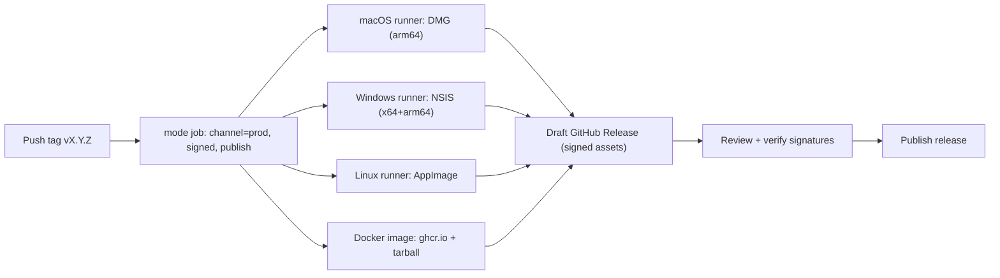

# GingerMail

A cross-platform (macOS + Windows) desktop email client with an Apple Mail style UI, an Outlook style calendar tab, and a Google Tasks style tasks tab. Themed to match the OS, designed for ADHD-friendly use, with pluggable mail/calendar/task providers and optional cloud or local AI.

## Stack

- Electron + Vite + React + TypeScript (pnpm workspace)
- `better-sqlite3` for local message/event/task cache
- `electron-builder` for packaging (DMG on macOS, NSIS on Windows)
- Providers: Gmail (googleapis), Microsoft (Graph + MSAL), Apple (CalDAV + IMAP), generic IMAP/SMTP (ImapFlow + nodemailer), POP3 (node-poplib)
- AI: OpenAI/Anthropic-compatible cloud OR local Ollama (settings-driven)

## Layout

```
apps/
  main/        Electron main process (window, IPC, scheduler, secure storage, notifications)
  renderer/    React UI: Mail / Calendar / Tasks / Settings tabs
packages/
  core/        Domain models (Account, Folder, Message, Event, Task), focus + snooze logic
  providers/   Adapters: gmail, microsoft, apple-caldav, imap-smtp, pop3
  ai/          LLM client abstraction (cloud or local Ollama)
  ui-kit/      Themed React primitives, ADHD defaults
  storage/     SQLite + electron-store + safeStorage wrappers
```

## First-time setup (new here? start here)

New to the codebase or just reviewing it? This section takes you from a fresh
clone to a running app with no prior knowledge assumed.

### Prerequisites

| Tool                 | Version           | Notes                                                                                        |
| -------------------- | ----------------- | -------------------------------------------------------------------------------------------- |
| Node.js              | `22` or `24`      | `engines` requires `>=20`, but use an **even LTS (22 or 24)** - see note below.              |
| pnpm                 | `9`               | This repo is a pnpm workspace. Install via Corepack (below) - don't use npm/yarn.            |
| Git                  | any recent        | To clone the repo.                                                                           |
| Platform build tools | only if compiling | Native modules (`better-sqlite3`) - needed _only_ when no prebuilt binary matches your Node. |

> **Use Node 22 or 24.** `better-sqlite3` (and `better-sqlite3-multiple-ciphers`)
> only ship prebuilt binaries for specific Node ABIs - currently Node **22**
> (ABI 127) and **24** (ABI 137), not Node 18 or 20. On Node 22/24 `pnpm install`
> just downloads the prebuilt binary, so you need **no compiler and no Python**.
> On Node 18/20 there is no prebuilt binary, so the install falls back to
> compiling from source (`node-gyp`), which is the usual cause of the
> `No prebuilt binaries found` / `Could not find any Python` install failure.

Platform build tools are needed **only** if you must compile from source (i.e.
you're on a Node version without a prebuilt binary, or an unusual platform):

- **macOS:** Xcode Command Line Tools (`xcode-select --install`).
- **Windows:** "Desktop development with C++" workload (Visual Studio Build Tools).
- **All:** a working `node-gyp` toolchain. Python **3.11** is the safest choice -
  Python 3.12+ dropped `distutils`, which the native rebuild chain still expects.

### Clone to running app

```bash
git clone <repo-url> && cd GingerMail2
corepack enable                  # makes the pinned pnpm@9 available
pnpm install
pnpm rebuild-native              # REQUIRED: rebuild better-sqlite3 against Electron's Node ABI
pnpm dev                         # launches the desktop window with hot reload
```

> Why `pnpm rebuild-native`? `better-sqlite3` ships prebuilt for plain Node, but
> Electron bundles its own Node ABI. Skipping this step is the #1 first-run
> failure - the app crashes on launch with a native-module version mismatch. If
> you ever hit that error, just rerun it.

You do **not** need any OAuth/provider credentials to boot the app and review the
UI - `pnpm dev` runs fine without them. Credentials are only needed to actually
connect a live mail/calendar/task account (see [`docs/PACKAGING.md`](docs/PACKAGING.md)).

### Verify your checkout

These run without any credentials, so they're the quickest way to confirm a
healthy setup:

```bash
pnpm typecheck   # TypeScript project-reference build, no emit
pnpm lint        # ESLint (zero warnings allowed)
pnpm test        # unit + component tests across all packages
```

### Where do I look? (repo tour)

See the [Layout](#layout) tree above for the full map. The key entry points:

- `apps/main/entry.cjs` + `apps/main/src/` - Electron main process (windows, IPC, scheduler, secure storage).
- `apps/renderer/src/` - the React UI (Mail / Calendar / Tasks / Settings tabs).
- `packages/core/` - domain models (Account, Folder, Message, Event, Task) and focus/snooze logic.
- `packages/providers/` - the Gmail / Microsoft / Apple / IMAP / POP3 adapters.

Helpful docs: [`docs/ROADMAP.md`](docs/ROADMAP.md) (what's shipped vs. planned),
[`docs/QA.md`](docs/QA.md) (testing + UI/UX notes), [`docs/PACKAGING.md`](docs/PACKAGING.md)
(builds, signing, OAuth setup), and [`docs/compliance/`](docs/compliance/) (security program).

### Troubleshooting first run

| Symptom                                                                                                                                              | Fix                                                                                                                                                                                                                                                                                                                                                                            |
| ---------------------------------------------------------------------------------------------------------------------------------------------------- | ------------------------------------------------------------------------------------------------------------------------------------------------------------------------------------------------------------------------------------------------------------------------------------------------------------------------------------------------------------------------------ |
| `pnpm install` fails at `better-sqlite3` with `No prebuilt binaries found (target=18.x …)` then `gyp ERR! find Python` / `Could not find any Python` | You're on Node 18/20, which has no prebuilt binary, so it tries (and fails) to compile. **Switch to Node 22 or 24** (`nvm install 22 && nvm use 22`, or `corepack`-aware setup) and rerun `pnpm install` - it then downloads the prebuilt binary, no Python needed. (Alternatively, stay on your Node version and install Python 3 + Xcode CLT so it can compile from source.) |
| `Unsupported engine: wanted {"node":">=20"}`                                                                                                         | Your Node is too old; install Node 22 or 24 (see above).                                                                                                                                                                                                                                                                                                                       |
| `better-sqlite3` / "NODE_MODULE_VERSION" mismatch                                                                                                    | Rerun `pnpm rebuild-native`.                                                                                                                                                                                                                                                                                                                                                   |
| `pnpm` not found or wrong version                                                                                                                    | `corepack enable && corepack prepare pnpm@9.0.0 --activate`.                                                                                                                                                                                                                                                                                                                   |
| `node-gyp` / `ModuleNotFoundError: distutils` (macOS)                                                                                                | Use Python 3.11 (`brew install python@3.11`).                                                                                                                                                                                                                                                                                                                                  |

## Getting started

```bash
pnpm install
pnpm rebuild-native       # native module rebuild against Electron's Node ABI
```

### Launch the desktop app

After `pnpm install` (and `pnpm rebuild-native`), launch GingerMail one of two ways:

**Development (hot reload):** starts the Vite renderer and the Electron main
process together and opens the desktop window with live reload on both.

```bash
pnpm dev
```

**Packaged build:** build a native installer for your current OS, then launch
the installed app. Output lands in `release/<version>/`. Local builds are
unsigned by default (they launch with a Gatekeeper/SmartScreen warning); the
release pipeline signs and notarizes automatically when the signing secrets are
present (see [Releasing](#releasing--deployment)).

```bash
pnpm dist:mac:no-ollama     # DMG     (macOS host)  -> open the .dmg, drag to /Applications, launch
pnpm dist:win:no-ollama     # NSIS    (Windows host) -> run the .exe installer, launch from Start menu
pnpm dist:linux:no-ollama   # AppImage (Linux host)  -> chmod +x the .AppImage, then run it
```

> The `:no-ollama` variants skip the bundled-Ollama fetch and fall back to a
> user-installed Ollama. For a guaranteed-unsigned local build (never hunts for
> a keychain identity), use the `:dev` variants (`pnpm dist:mac:dev`). Drop the
> suffix (e.g. `pnpm dist:mac`) once certs are in place for a signed,
> Ollama-bundled build. See [`docs/PACKAGING.md`](docs/PACKAGING.md) for signing,
> cross-platform release builds, and the full matrix.

## Run via Docker (browser-accessible)

The native installers (`.dmg` / `.exe` / `.AppImage`) are the primary way to run
GingerMail. As a convenience, the project also ships a Docker image that runs the
Linux build on a minimal [KasmVNC](https://github.com/linuxserver/docker-baseimage-kasmvnc)
desktop, so you can reach the full app from a browser without installing anything
natively.

### Get the image

**Option A - download from a GitHub Release** (no build toolchain needed):

```bash
# Download gingermail-<version>-docker.tar.gz from the Release assets, then:
docker load < gingermail-<version>-docker.tar.gz
```

**Option B - build it yourself from the repo root:**

```bash
docker build -t gingermail:dev .
```

The build is multi-stage: it compiles the renderer + main + packages, runs
`electron-builder --linux dir`, and copies the unpacked app onto the KasmVNC
base image. See [`Dockerfile`](Dockerfile).

### Run it

```bash
docker run -d --name gingermail \
  -p 3001:3001 \
  --shm-size=1g \
  -v gingermail-data:/config \
  gingermail:<version>   # or gingermail:dev if you built locally
```

Then open **https://localhost:3001** (self-signed cert, so accept the browser
warning on first load).

| Flag                         | Why                                                                |
| ---------------------------- | ------------------------------------------------------------------ |
| `-p 3001:3001`               | KasmVNC web UI (HTTPS). Map to another host port if 3001 is taken. |
| `--shm-size=1g`              | Gives Chromium enough shared memory; the app may crash without it. |
| `-v gingermail-data:/config` | Persists accounts, cache, and settings across restarts.            |

### Manage the container

```bash
docker logs -f gingermail     # follow startup / app logs
docker stop gingermail        # stop
docker start gingermail       # start again (data persists in the volume)
docker rm -f gingermail       # remove the container (volume is kept)
```

To upgrade, `docker rm -f gingermail`, load/build the new image, and `docker run`
again with the same `-v gingermail-data:/config` volume.

> The container runs Electron with `--no-sandbox` because containers lack the
> user-namespace sandbox, so treat Docker as a convenience channel rather than
> the hardened native build. Full build details are in
> [`docs/PACKAGING.md`](docs/PACKAGING.md).

## Releasing / deployment

Releases are produced by the **`Release` GitHub Actions workflow**
([`.github/workflows/release.yml`](.github/workflows/release.yml)), not by hand.
Building all three platforms reliably from one machine isn't possible (Windows
NSIS needs Wine, Linux AppImage needs a Linux toolchain), so CI builds each OS on
its own native runner.



### Cut a release (primary path)

```bash
# 1. Bump "version" in package.json, commit it.
# 2. Tag and push:
git tag v1.0.5
git push origin v1.0.5
```

A tag push runs the **prod** channel: it builds the macOS DMG (arm64), Windows
NSIS (x64 + arm64), Linux AppImage, and the Docker image; signs/notarizes each
when the corresponding secrets exist (graceful unsigned fallback otherwise); and
creates a **draft** GitHub Release with all assets attached
(`.dmg` / `.exe` / `.AppImage`, `*.sig`, `SHA256SUMS`, `latest*.yml`,
`.blockmap`, and the Docker tarball). You then verify the assets and publish the
draft. The build matrix is `fail-fast: false`, so one OS leg failing doesn't
block the others.

### Dev builds (no certificates needed)

From the Actions tab, run the workflow manually (`workflow_dispatch`) with
`channel = dev` to get **unsigned** installers for all three OSes - macOS
notarization is forced off and keychain discovery disabled, so no leg can fail
for missing credentials. Tick `publish_release` to also cut a draft pre-release
named `… (dev / unsigned)`.

See [`docs/PACKAGING.md`](docs/PACKAGING.md) for the required signing secrets,
how to provision Apple/Windows/GPG credentials, signature-verification commands,
and the bundled-Ollama toggle.

## Continuous integration

Every pull request and push to `main` runs the **CI workflow**
([`.github/workflows/ci.yml`](.github/workflows/ci.yml)):

- `pnpm lint` - ESLint (zero warnings allowed)
- `pnpm typecheck` - `tsc -b` across the workspace
- `pnpm test` - unit + component tests
- `pnpm audit:prod` - fails on high/critical vulnerabilities in production deps
- A CycloneDX SBOM (`pnpm sbom`) is generated and uploaded as an artifact on `main`.

## Auto-updates

Installed apps check for updates on launch via `electron-updater`
([`apps/main/src/autoUpdater.ts`](apps/main/src/autoUpdater.ts)). The feed is the
`generic` provider configured in
[`electron-builder.yml`](electron-builder.yml)
(`https://updates.gingermail.app/${channel}/${os}`); the `latest*.yml` manifests
are SHA512-signed and verified before any bytes hit disk, so a hostile mirror
can't substitute or downgrade an installer. The runtime auto-updater ships behind
a safety toggle (`updates.optIn`) that is **off by default** and is a no-op until
the publish endpoint exists.

## ADHD-first defaults

- Low-stimulation palette and generous spacing by default
- Universal snooze on every email / event / task
- Focus Mode (Cmd/Ctrl+Shift+F) - dims everything but the active item, suppresses notifications, optional Pomodoro break nudge
- Optional dyslexic-friendly font, adjustable density and font size
- Notifications batched into a single digest by default (not per email)

## Status

Phased build - see `docs/ROADMAP.md` for what's shipped and what's next.

## Security & compliance

- Security policy: `SECURITY.md`; hardening summary: `docs/security-hardening.md`.
- NIST 800-53 / 800-171 / CSF 2.0 / FedRAMP-readiness program (scope, control
  crosswalk, threat model, SSP, POA&M): `docs/compliance/`.

## License

GingerMail is **source-available**, licensed under the
[PolyForm Noncommercial License 1.0.0](LICENSE).

- **Noncommercial use is free** - personal, hobby, research, educational, and
  use by nonprofit/government organizations is permitted at no cost.
- **Commercial use requires a separate license.** If you want to use GingerMail
  for a commercial purpose, contact the author to arrange a commercial license.

Copyright (c) 2026 William Skidmore. All rights not expressly granted by the
PolyForm Noncommercial License are reserved.
