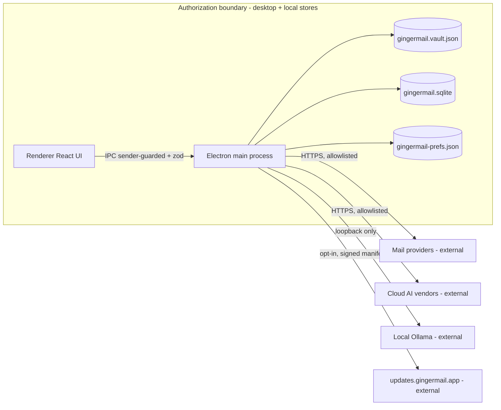

# GingerMail compliance program

This directory holds GingerMail's security-compliance program artifacts. It
aligns the desktop application to recognized US federal control frameworks so
that the project can (a) self-assess its security posture against an objective
yardstick and (b) hand a reviewer a coherent control story.

## Frameworks targeted

| Framework       | Version         | Role in this program                                                                  |
| --------------- | --------------- | ------------------------------------------------------------------------------------- |
| NIST SP 800-53  | Rev 5           | Primary control catalog. We track the FedRAMP **Moderate** baseline subset.           |
| NIST SP 800-171 | Rev 3           | CUI-protection requirement mapping (for deployment into contractor/CUI environments). |
| NIST CSF        | 2.0             | Program structure (Govern / Identify / Protect / Detect / Respond / Recover).         |
| FedRAMP         | Rev 5 baselines | Parameter values + baseline selection layered on top of 800-53.                       |

## Scope and authorization boundary

The evaluated boundary is the **desktop application and its local data stores
only**:

- Application code: `apps/main` (Electron main process), `apps/renderer`
  (React UI), and the workspace `packages/*` (core, providers, ai, ui-kit,
  storage).
- Local data at rest in the OS user-data directory:
  - `gingermail.sqlite` - encrypted message/event/task cache.
  - `gingermail.vault.json` - OS-encrypted secrets vault (DB key, account
    credentials, OAuth tokens, cloud AI key).
  - `gingermail-prefs.json` - non-secret preferences.

The following are **outside** the boundary and are treated as external
systems / interconnections (documented in the SSP, not assessed here):

- The auto-update host `updates.gingermail.app`.
- Third-party mail providers (Gmail, Microsoft Graph, Apple, generic
  IMAP/SMTP/POP3).
- Third-party cloud AI vendors (OpenAI, Anthropic, Google) when cloud AI is
  opted in.
- The local Ollama sidecar (loopback only).

## FedRAMP applicability - read this first

FedRAMP authorizes **cloud service offerings (CSOs)** operated for federal
agencies. GingerMail, within the boundary defined above, is a locally
installed desktop client with **no operated cloud backend** (see
[PRIVACY.md](../../PRIVACY.md): "we have no servers except the static update
host"). Therefore:

- This program **cannot and does not** produce an actual FedRAMP ATO. There is
  no cloud system boundary to authorize within the current scope.
- We instead use the FedRAMP Moderate **control selection and parameters** as
  a rigorous yardstick to self-assess the client ("FedRAMP Moderate
  readiness for the desktop client").
- An actual FedRAMP authorization would require **expanding the boundary** to
  include an operated cloud component (e.g. a hosted sync/backend or the
  update-distribution service) and pursuing it as the CSO. The
  [SSP](ssp.md) documents exactly which control families would shift from the
  endpoint to that cloud boundary.

This caveat is intentional and is repeated in the SSP so the artifacts are
never mistaken for an authorization package.

## Artifacts in this directory

| File                                                                       | Purpose                                                                                |
| -------------------------------------------------------------------------- | -------------------------------------------------------------------------------------- |
| [control-crosswalk.md](control-crosswalk.md)                               | 800-53 <-> 800-171 <-> CSF crosswalk mapped to GingerMail implementations with status. |
| [threat-model.md](threat-model.md)                                         | STRIDE + data-flow threat model for the desktop boundary.                              |
| [ssp.md](ssp.md)                                                           | System Security Plan scaffold (OSCAL-convertible).                                     |
| [poam.md](poam.md)                                                         | Plan of Action & Milestones generated from the gap assessment.                         |
| [policies/](policies/)                                                     | Per-family policy and procedure set.                                                   |
| [assessment/continuous-monitoring.md](assessment/continuous-monitoring.md) | Continuous-monitoring cadence and CI enforcement.                                      |

## How to maintain

1. When a control implementation changes in code, update its row in
   [control-crosswalk.md](control-crosswalk.md) and the corresponding control
   summary in [ssp.md](ssp.md).
2. When a gap is found, add a POA&M row in [poam.md](poam.md); when it is
   closed, move it to the closed section with the resolving commit/PR.
3. Re-run the self-assessment each release; record results under
   `assessment/`.
4. Keep these artifacts evidence-accurate: do not describe a control as
   implemented unless the cited file actually implements it. (The
   pre-existing [docs/security-hardening.md](../security-hardening.md) drift,
   where CI was described as shipped but absent, is the failure mode to
   avoid.)
