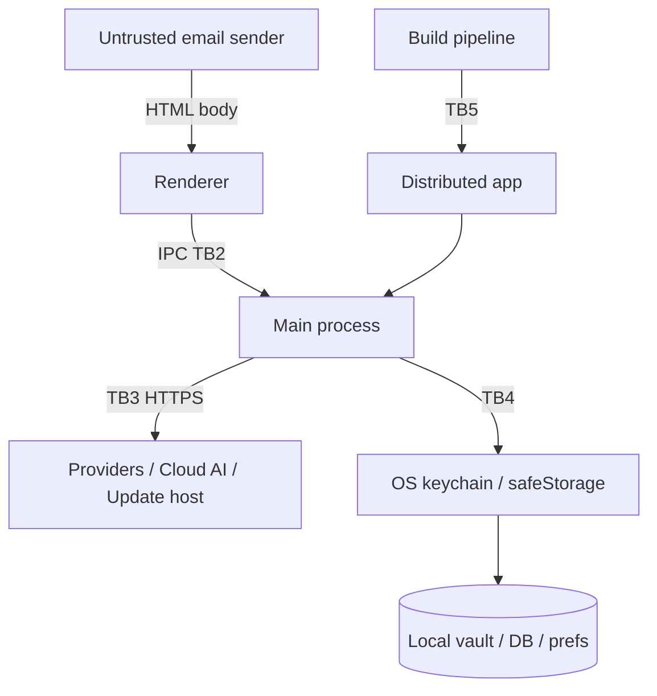

# GingerMail threat model

Method: STRIDE over the data-flow diagram of the desktop authorization
boundary (see [README.md](README.md)). Supports NIST RA-3 (risk assessment)
and CSF ID.RA. This is a living document; revisit each release and when a new
trust boundary is added.

## Assets

- A1: Mail content at rest (bodies, headers, attachments, outbox drafts) in
  `gingermail.sqlite`.
- A2: Account credentials and tokens (IMAP/SMTP passwords, OAuth access/refresh
  tokens) in `gingermail.vault.json`.
- A3: DB encryption key (in the same vault).
- A4: Cloud AI API key (in the vault).
- A5: User attention/integrity of displayed content (anti-phishing, anti-XSS).
- A6: Software integrity of the installed app and its updates.

## Trust boundaries

- TB1: Remote mail sender -> rendered mail HTML (fully untrusted input).
- TB2: Renderer process -> main process (IPC). Renderer is treated as
  semi-trusted: a renderer compromise (XSS) must not yield host/file/secret
  access.
- TB3: Main process -> external network (mail providers, cloud AI, update
  host).
- TB4: OS keychain / `safeStorage` -> local files.
- TB5: Build/release pipeline -> distributed binary -> end-user machine.

## STRIDE analysis

### TB1 - Untrusted mail HTML (asset A5)

- Spoofing/Tampering: malicious HTML attempts script execution or remote
  beacon. Mitigation: DOMPurify allow-list (`packages/core/src/mailHtml.ts`),
  rendered in `sandbox=""` iframe with `srcDoc` + meta CSP
  (`apps/renderer/src/tabs/MailTab.tsx`); remote images gated by default.
  (SI-3, SC-18). Residual: `style-src 'unsafe-inline'` inside the iframe;
  tracking pixels load when user opts into images.
- Information disclosure: quoted HTML in reply/forward drafts is embedded
  without re-sanitization in `register.ts quoteBody()`. Residual risk tracked
  in POA&M (lower severity - confined to composer).

### TB2 - Renderer -> main IPC (assets A1-A4)

- Elevation of privilege: a compromised renderer invokes privileged handlers.
  Mitigation: universal sender guard (`isMainWindowSender`) + zod validation
  via `safeHandle` (`apps/main/src/ipc/guards.ts`). Renderer never receives
  secrets (settings stripped in `context.ts getSettingsForRenderer`). (SI-10,
  AC-6).
- Tampering: arbitrary file read via path injection. Mitigation: ICS import
  forces a native dialog rather than accepting a renderer path
  (`register.ts calImportIcs`). (SI-10).
- Residual: many mail/write channels still use the unvalidated `handle()`
  wrapper; `SettingsUpdateSchema`/`AddAccountInputSchema` use `.passthrough()`.
  Tracked in POA&M (P1).

### TB3 - Main -> network (assets A1, A4)

- Information disclosure: cloud AI request exfiltrates more than intended, or
  to a wrong host. Mitigation: egress allowlist + HTTPS enforcement
  (`aiEgress.ts`), optional PII redaction, sensitive-account block.
  Residual: egress filter is on the renderer session, not the main-process
  `fetch` actually used for cloud calls (defense-in-depth only). Tracked in
  POA&M.
- Spoofing: hostile update mirror serves a malicious installer. Mitigation:
  electron-updater SHA512 manifest verification + opt-in + kill-switch
  (`autoUpdater.ts`). Residual: `requireSignedUpdates` is documented but not
  set in code, and binaries are unsigned (`identity: null`). Tracked in POA&M
  (P1, SI-7/CM-14).

### TB4 - Secret storage at rest (assets A2, A3, A4)

- Information disclosure: another local user / malware reads secrets.
  Mitigation: OS keychain via `safeStorage` (`tokenVault.ts`); DB encrypted
  with a 256-bit key. Residual:
  - When `safeStorage` is unavailable the vault is written as **plaintext
    JSON with no warning** - DB key + all credentials exposed. P0 in POA&M.
  - Plaintext `*.pre-encryption.*.bak` migration artifacts persist on disk.
  - `gingermail-prefs.json` is plaintext (no secrets today, but no guard).
  - No file-permission hardening (chmod 600). (SC-28, IA-5).

### TB5 - Build/release pipeline (asset A6)

- Tampering: dependency compromise or build tampering ships malicious code.
  Mitigation: lockfile + pinned package manager. Residual: **no CI**, no SAST,
  no dependency scan gate, no SBOM in releases, unsigned binaries, placeholder
  Ollama SHAs. This is the largest cluster of gaps. (SA-11, RA-5, SR-4, SR-11,
  CM-14). Tracked in POA&M (P0/P1).

## Top risks (ranked)

1. Unsigned binaries + unimplemented `requireSignedUpdates` (TB5/TB3): a
   tampered or mirrored installer cannot be cryptographically rejected today.
2. Silent plaintext secrets fallback (TB4): catastrophic local disclosure if
   `safeStorage` is unavailable, with no user signal.
3. No CI/SAST/dependency gate (TB5): regressions and vulnerable dependencies
   can ship unnoticed.
4. Unwired IPC validation on write channels (TB2): weakens the renderer->main
   trust boundary.
5. Egress filter not on the real cloud-AI fetch path (TB3): allowlist is
   advisory rather than enforced for cloud calls.

Each maps to a POA&M item with a remediation milestone.
