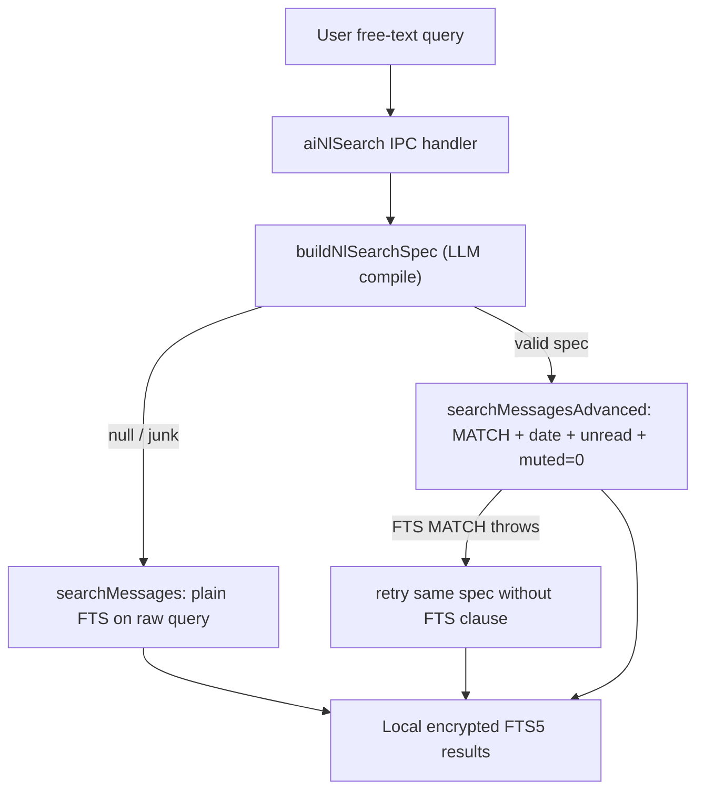

# GM-IP-01 — LLM-mediated natural-language to SQLite FTS5 query compilation with graceful local fallback

> **Status: disclosure record, not a filed application. Not legal advice.** See
> [README.md](README.md). Keep confidential until counsel advises on filing.

## 1. Administrative

| Field           | Value                                  |
| --------------- | -------------------------------------- |
| Invention ID    | GM-IP-01                               |
| Inventor(s)     | _TBD — complete before filing_         |
| Conception date | _TBD_                                  |
| Disclosure date | _TBD_                                  |
| Status          | Implemented and shipping in GingerMail |

## 2. Technical field

Desktop email clients; local full-text search; application of large language
models (LLMs) to compile natural-language queries into structured database
search expressions executed against an on-device encrypted store.

## 3. Problem addressed

Full-text search over email is powerful but unforgiving: engines such as SQLite
FTS5 expose a terse `MATCH` syntax (column scoping like `from_text:"alice"`,
boolean `AND`/`OR`, quoting rules) that ordinary users neither know nor want to
learn. Date filtering ("emails from last week") is a separate concern that FTS
syntax does not express at all. Conventional clients either (a) force the user
to learn an advanced-search grammar, (b) ship a rigid form of dropdowns and date
pickers, or (c) send the user's query and/or mailbox contents to a server-side
search service, which is incompatible with a local-first, privacy-preserving
architecture.

The challenge is to let a user type "unread budget emails from alice last week"
and get correct results, **without** a server, **without** exposing message
bodies to a remote service for the search itself, and **without** the whole
feature collapsing when the (small, local) language model emits malformed
output.

## 4. Summary of the invention

A method in which an LLM is used purely as a **query compiler**: it transforms a
free-text query into a constrained, machine-runnable **search specification**
(an FTS5 `MATCH` expression plus normalized date bounds plus an unread flag plus
a short human-readable explanation), which the application then executes
**locally** against its encrypted SQLite FTS5 index. Three properties make the
combination distinctive:

1. **The model never sees or returns message contents.** It receives only the
   query string and a description of the index schema, and returns only a
   structured spec. The actual search runs on-device.
2. **The model is constrained to the index's own column vocabulary** (`subject`,
   `snippet`, `from_text`, `body_text`) and to FTS5 MATCH syntax, and is
   instructed to resolve relative dates against the current date before
   returning.
3. **Deterministic graceful degradation.** If the model returns unparseable or
   junk output, the system silently falls back to a plain FTS search of the raw
   query; and if the model's `MATCH` expression is itself malformed at execution
   time, the database layer retries the same structured query with the FTS
   clause removed (preserving the date/unread filters). The feature therefore
   never hard-fails, which is what makes it safe to drive with a small local
   model.

## 5. Detailed description

### 5.1 Prompt: schema-aware spec generation

The system prompt pins the model to the index columns, the output JSON shape,
and FTS5-specific authoring rules, and injects the current date for relative
date resolution:

```33:50:packages/ai/src/prompts.ts
export function nlSearchPrompt(): string {
  const today = new Date().toISOString().slice(0, 10);
  return [
    'You convert a natural-language email search query into a JSON spec the app can run against a SQLite FTS5 index.',
    'The FTS index has these searchable columns: subject, snippet, from_text, body_text.',
    `Today is ${today}. Resolve relative dates ("last week", "yesterday") against that.`,
    'Reply with ONLY a JSON object of this shape:',
    '{"ftsQuery": string, "after": ISO8601 date optional, "before": ISO8601 date optional, "unread": boolean optional, "explanation": string}',
    'Rules for ftsQuery:',
    '- Wrap each user term in double quotes ("foo bar").',
    '- When the user names a sender, scope the term: from_text:"alice".',
    '- When they mention "subject", scope: subject:"budget".',
    '- Combine multiple terms with AND. Use OR only when the user clearly wants either/or.',
    '- Never include SQL, only FTS5 MATCH syntax.',
    '- If the user supplies no meaningful keywords, set ftsQuery to "".',
    'The explanation is one short sentence (< 12 words) describing how you interpreted the query, addressed to the user.',
  ].join(' ');
}
```

### 5.2 Spec type and defensive parsing

The compiled spec is a narrow, typed object. Parsing is defensive: code fences
are stripped, and any non-conforming output yields `null` (the fallback signal),
not an exception:

````572:622:packages/ai/src/client.ts
export interface NlSearchSpec {
  ftsQuery: string;
  after?: string;
  before?: string;
  unread?: boolean;
  explanation: string;
}

export async function buildNlSearchSpec(
  client: AiClient,
  query: string,
): Promise<NlSearchSpec | null> {
  const out = await client.chat({
    messages: [
      { role: 'system', content: nlSearchPrompt() },
      { role: 'user', content: query },
    ],
    format: 'json',
    temperature: 0.1,
    maxTokens: 256,
  });
  // Models love to wrap JSON in ```json fences; strip them defensively.
  const cleaned = out
    .trim()
    .replace(/^```(?:json)?\s*/i, '')
    .replace(/```$/i, '')
    .trim();
  try {
    const parsed = JSON.parse(cleaned) as Partial<NlSearchSpec>;
    if (typeof parsed !== 'object' || parsed === null) return null;
    return {
      ftsQuery: typeof parsed.ftsQuery === 'string' ? parsed.ftsQuery : '',
      after: typeof parsed.after === 'string' ? parsed.after : undefined,
      before: typeof parsed.before === 'string' ? parsed.before : undefined,
      unread: typeof parsed.unread === 'boolean' ? parsed.unread : undefined,
      explanation: typeof parsed.explanation === 'string' ? parsed.explanation : '',
    };
  } catch {
    return null;
  }
}
````

### 5.3 First fallback: model produced no usable spec

The IPC handler wires the compiler to the local index and degrades to plain FTS
when the model yields nothing usable:

```154:177:apps/main/src/ipc/aiHandlers.ts
  handle(IPC_CHANNELS.aiNlSearch, async (_e, query: string): Promise<NlSearchResult> => {
    const trimmed = (query ?? '').trim();
    const fallback = (): NlSearchResult => ({
      messages: trimmed ? ctx.db.searchMessages(trimmed, 100) : [],
      usedAi: false,
      query: trimmed,
    });
    // ...
    const spec = await buildNlSearchSpec(client, trimmed);
    if (!spec) {
      log.warn('[ai] NL search: model returned no usable spec, falling back to FTS');
      return fallback();
    }
    const after = spec.after ? Date.parse(spec.after) || undefined : undefined;
    const before = spec.before ? Date.parse(spec.before) || undefined : undefined;
    const messages = ctx.db.searchMessagesAdvanced(
      { ftsQuery: spec.ftsQuery, after, before, unread: spec.unread },
      100,
    );
```

### 5.4 Second fallback: spec ran but its FTS clause was malformed

The storage layer executes the structured spec and, if FTS5 rejects the
`MATCH` expression at runtime, re-runs the **same** query with the FTS clause
dropped so the date/unread filters still apply. It also always appends a
`muted = 0` guard so muted senders never leak into results:

```1070:1116:packages/storage/src/db.ts
  searchMessagesAdvanced(
    spec: { ftsQuery?: string; after?: number; before?: number; unread?: boolean },
    limit = 100,
  ): MessageHeader[] {
    const hasFts = !!spec.ftsQuery && spec.ftsQuery.trim().length > 0;
    const where: string[] = [];
    const args: unknown[] = [];

    if (hasFts) {
      where.push('messages_fts MATCH ?');
      args.push(spec.ftsQuery);
    }
    // ... date + unread filters ...
    if (where.length === 0) return [];
    where.push('m.muted = 0');
    // ...
    try {
      const rows = this.db.prepare(sql).all(...args) as MessageRow[];
      return rows.map(rowToHeader);
    } catch {
      // If the AI handed us a malformed FTS expression, fall back to the same
      // query minus the FTS clause so we at least honour date/unread filters.
      if (hasFts) {
        return this.searchMessagesAdvanced({ ...spec, ftsQuery: undefined }, limit);
      }
      return [];
    }
  }
```

The plain-FTS path used by both the no-spec fallback and power users is itself
defensive: it tries the raw query, then a sanitized version via `safeFtsQuery`,
then returns empty rather than crashing the IPC channel
([packages/storage/src/db.ts](../../packages/storage/src/db.ts), `searchMessages`).

### 5.5 Data flow



## 6. Novel / distinguishing features

- **LLM as a constrained query compiler, not an answer engine.** The model's
  entire job is to emit a runnable spec in the index's own column vocabulary;
  retrieval happens locally over the encrypted store.
- **Privacy posture is structural, not a policy bolt-on.** Because only the
  query string (not mailbox contents) is sent to the model, and because in local
  mode the model is the on-device Ollama sidecar (see
  [GM-IP-04](04-bundled-local-ai-sidecar.md)), search can be fully on-device.
- **Two-stage deterministic fallback** (no-spec → plain FTS; malformed MATCH →
  filters-only) makes the feature robust enough to drive with small local
  models, which is the regime where typical "LLM search" features break.
- **User-facing `explanation` field** compiled alongside the query gives
  transparency about how the natural-language input was interpreted.

## 7. Known / prior approaches and how this differs

| Prior approach                                          | How GM-IP-01 differs                                                                                  |
| ------------------------------------------------------- | ----------------------------------------------------------------------------------------------------- |
| Advanced-search grammars (Gmail operators, Outlook AQS) | User must learn syntax; here the LLM compiles natural language into the grammar automatically.        |
| Server-side semantic/vector search over mailbox         | Requires uploading/indexing mail server-side; GM-IP-01 keeps index and execution on-device.           |
| LLM RAG that returns answers from retrieved emails      | Returns generated prose, not a runnable query; GM-IP-01 returns a deterministic spec the DB executes. |
| Form-based filters (date pickers, sender dropdowns)     | Rigid and verbose; GM-IP-01 maps a single sentence onto column-scoped MATCH + date bounds.            |

The novelty asserted here is the **specific pipeline**: schema-and-syntax-pinned
LLM compilation into an FTS5 spec, executed against an on-device encrypted
index, with deterministic two-stage degradation — not the use of FTS5 or LLMs
individually.

## 8. Claim sketches (plain language)

**Independent (method).** A computer-implemented method comprising: receiving a
natural-language search query at a local application; submitting the query, with
a description of a local full-text index's searchable columns and the current
date, to a language model constrained to return a structured search
specification comprising a full-text MATCH expression and optional normalized
date bounds and an unread flag; executing the specification against an on-device
full-text index over locally cached messages; and returning matching messages —
wherein contents of the cached messages are not transmitted to the language
model.

**Dependent claims.**

- wherein the language model also returns a human-readable explanation of its
  interpretation, displayed to the user.
- wherein, responsive to the language model returning output that does not parse
  as the specification, the method falls back to executing a plain full-text
  search of the raw query.
- wherein, responsive to the full-text engine rejecting the MATCH expression at
  execution time, the method re-executes the specification with the MATCH clause
  removed while retaining the date and unread constraints.
- wherein the language model is constrained to scope sender terms to a sender
  column and subject terms to a subject column of the index.
- wherein the language model is a model executing on the same device as the
  index (loopback-only), such that the search is performed entirely on-device.
- wherein messages from muted senders are excluded from the index and therefore
  from results.

## 9. Enablement pointers

- [packages/ai/src/prompts.ts](../../packages/ai/src/prompts.ts) — `nlSearchPrompt`
- [packages/ai/src/client.ts](../../packages/ai/src/client.ts) — `NlSearchSpec`, `buildNlSearchSpec`
- [apps/main/src/ipc/aiHandlers.ts](../../apps/main/src/ipc/aiHandlers.ts) — `aiNlSearch` handler + fallback
- [packages/storage/src/db.ts](../../packages/storage/src/db.ts) — `searchMessagesAdvanced`, `searchMessages`, `safeFtsQuery`
- [packages/storage/src/schema.ts](../../packages/storage/src/schema.ts) — `messages_fts` FTS5 virtual table

## 10. Recommended protection strategy

- **Patent (method):** the end-to-end compile-spec-execute-with-fallback pipeline
  is the strongest candidate for a method claim. Brief counsel with the two-stage
  degradation and on-device execution as the points of novelty.
- **Trade secret:** the exact prompt wording and authoring rules are a tuning
  asset; keep them confidential rather than publishing them in marketing
  material.
- Conduct a prior-art search focused on "LLM text-to-query" / "natural language
  to SQL/FTS" before filing; the differentiators to emphasize are the on-device
  encrypted-index execution and the deterministic fallbacks.
