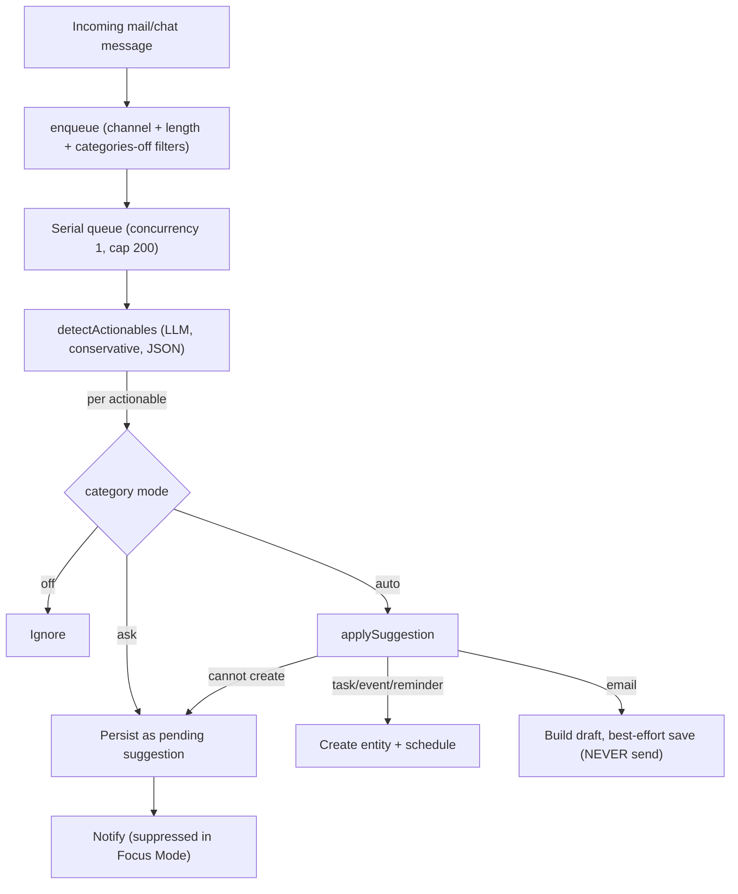

# GM-IP-02 — Cross-channel actionable-detection agent with per-category safe automation modes

> **Status: disclosure record, not a filed application. Not legal advice.** See
> [README.md](README.md). Keep confidential until counsel advises on filing.

## 1. Administrative

| Field           | Value                                  |
| --------------- | -------------------------------------- |
| Invention ID    | GM-IP-02                               |
| Inventor(s)     | _TBD — complete before filing_         |
| Conception date | _TBD_                                  |
| Disclosure date | _TBD_                                  |
| Status          | Implemented and shipping in GingerMail |

## 2. Technical field

Unified productivity clients (email + chat); automated extraction of actionable
items from incoming messages using a language model; safe automation policies
for AI-proposed actions in a communications application.

## 3. Problem addressed

Actionable obligations arrive across heterogeneous channels — email threads,
Slack messages, Discord messages — and in heterogeneous forms: "can you send the
contract to legal", "standup moved to 3pm tomorrow", "remind me to renew the
cert Friday", "we still need the Q3 numbers". A user (especially one with ADHD,
GingerMail's target audience) loses these because each channel has its own
inbox, and because turning a sentence into the right artifact (a calendar event,
a task, a reminder, a reply email) is friction that gets deferred.

Existing "smart" features tend to be (a) single-channel (email-only), (b)
all-or-nothing (either fully automatic, which is dangerous, or merely
suggestions the user must still find), and (c) unsafe: an agent that can act on
"send the contract" by actually **sending** email on the user's behalf is a
serious liability. The problem is to extract actionables across channels and act
on them with **per-category, user-chosen** levels of autonomy, while guaranteeing
that no irreversible or externally-visible action (notably: sending email) is
ever taken automatically.

## 4. Summary of the invention

A background **detection agent** that:

1. Accepts messages from **multiple source channels** (mail and chat) through a
   single normalized item type, scanning each with the configured AI client.
2. Classifies extracted actionables into **four categories** — `email`,
   `reminder`, `event`, `task` — using a conservative, fact-grounded prompt.
3. Applies a **per-category automation mode** chosen by the user: `auto`
   (act now), `ask` (queue a pending suggestion for review), or `off` (ignore).
4. Enforces a **safety invariant**: for the `email` category, `auto` mode never
   sends; it builds and best-effort saves a _draft_ only. Categories that cannot
   be safely auto-created (e.g. an event with no resolvable date) automatically
   downgrade from `auto` to `ask`.
5. Runs as a **bounded serial queue** (concurrency 1, capped length) so a burst
   of messages cannot overwhelm a local model, and **persists** every result
   with a `(source_id, category, title)` dedupe key so re-scanning the same
   message never produces duplicates and auto-added items remain undoable across
   restarts.
6. Suppresses its own notifications during Focus Mode.

## 5. Detailed description

### 5.1 Channel-agnostic input and category-grounded extraction

A single `DetectionItem` carries either a chat or a mail message, plus the
identifiers needed for dedupe and linking. The shared extractor prompt defines
exactly four categories and is explicitly conservative ("Never invent
recipients, dates, or facts"; "If nothing is actionable, return an empty
array"):

```64:82:packages/ai/src/prompts.ts
export function detectActionablesPrompt(): string {
  const today = new Date().toISOString().slice(0, 10);
  return [
    'You scan a single chat or email message for ACTIONABLE items the user should act on.',
    'There are four categories:',
    '- "email": the message implies the user should send an email/reply to someone.',
    '- "reminder": a simple time-based nudge with no calendar invite needed.',
    '- "event": a meeting/appointment with a specific date/time (and optionally a location).',
    '- "task": a concrete to-do the user must complete.',
    `Today is ${today}. Resolve relative dates ("tomorrow", "next Friday 3pm") into absolute ISO 8601 datetimes.`,
    'Be conservative: only report items that are clearly actionable. If nothing is actionable, return an empty array.',
    'Never invent recipients, dates, or facts that are not supported by the message.',
    // ... strict JSON output shape ...
  ].join(' ');
}
```

The extractor returns typed `DetectedActionable`s; parsing is defensive so a
flaky local model never breaks sync ([packages/ai/src/client.ts](../../packages/ai/src/client.ts), `detectActionables`).

### 5.2 Bounded serial queue

The agent is a single-concurrency queue with a hard length cap and cheap
pre-filters (channel toggles, minimum text length, "all categories off"):

```45:74:apps/main/src/ai/detectionAgent.ts
  enqueue(ctx: AppContext, item: DetectionItem): void {
    const det = detectionSettings(ctx);
    if (!det.enabled) return;
    if (item.source === 'chat' && !det.scanChat) return;
    if (item.source === 'mail' && !det.scanMail) return;
    if (!item.text || item.text.trim().length < 8) return;
    // If every category is off there is nothing to do.
    if (Object.values(det.categories).every((m) => m === 'off')) return;
    if (this.queue.length >= this.maxQueue) {
      log.warn('[detection] queue full, dropping item');
      return;
    }
    this.queue.push({ ctx, item });
    void this.pump();
  }
```

### 5.3 Per-category mode + the email safety invariant

The core of the invention is the per-category dispatch with the
"email auto = draft only, never send" rule and the auto→ask downgrade:

```85:119:apps/main/src/ai/detectionAgent.ts
    for (const d of detected) {
      const mode = det.categories[d.category];
      if (mode === 'off') continue;

      const suggestion: Suggestion = {
        // ...
        status: mode === 'auto' ? 'auto-added' : 'pending',
        createdAt: Date.now(),
      };

      if (mode === 'auto') {
        const res = applySuggestion(ctx, suggestion);
        if (res.entityId) suggestion.createdEntityId = res.entityId;
        // Email auto-add: never send — try to persist as a draft instead.
        if (d.category === 'email' && res.draft) {
          const draftId = await autoSaveDraft(ctx, res.draft);
          if (draftId) suggestion.createdEntityId = draftId;
        }
        if (!res.ok) {
          // Couldn't auto-create (e.g. missing date) — fall back to asking.
          suggestion.status = 'pending';
        }
      }

      const inserted = ctx.db.insertSuggestions([suggestion]);
      if (inserted.length && suggestion.status === 'pending') pendingCount += 1;
    }
```

The shared applier makes the invariant structural: `email` suggestions can only
ever produce a `Draft` object, while task/event/reminder produce
side-effect-only entities. The same function backs both the auto path and the
"accept" IPC path:

```40:53:apps/main/src/ai/suggestionActions.ts
export function applySuggestion(ctx: AppContext, s: Suggestion): ApplyResult {
  switch (s.category) {
    case 'task':
      return createTask(ctx, s);
    case 'event':
      return createEvent(ctx, s);
    case 'reminder':
      return createReminder(ctx, s);
    case 'email':
      return { ok: true, draft: buildDraft(ctx, s) };
    default:
      return { ok: false, error: `Unknown category ${String(s.category)}` };
  }
}
```

Auto-added email drafts are _best-effort_ persisted to the provider's Drafts
folder, never sent:

```155:169:apps/main/src/ai/suggestionActions.ts
export async function autoSaveDraft(ctx: AppContext, draft: Draft): Promise<string | undefined> {
  try {
    const provider = await ctx.getMailProvider(draft.accountId);
    if (!provider?.saveDraft) return undefined;
    const saved = await provider.saveDraft(draft);
    return saved.id;
  } catch {
    return undefined;
  }
}
```

### 5.4 Persistence, dedupe, and undoability

Results persist with an enforced uniqueness index on `(source_id, category,
title)`, so re-scanning the same message is idempotent and auto-added items
survive restarts for later undo:

```282:303:packages/storage/src/schema.ts
 * Actionable items the AI detection agent found in chat/mail messages. Rows
 * persist so the review panel survives restarts and auto-added items stay
 * undoable. (source_id, category, title) form the dedupe key so re-scanning
 * the same message does not pile up duplicates.
 */
// ...
CREATE UNIQUE INDEX IF NOT EXISTS suggestions_dedupe_idx ON suggestions(source_id, category, title);
```

`insertSuggestions` uses `INSERT OR IGNORE` and returns only genuinely-new rows
so the agent notifies only on new pending items
([packages/storage/src/db.ts](../../packages/storage/src/db.ts), `insertSuggestions`).

### 5.5 Focus-Mode-aware notification

The agent suppresses its review pings while Focus Mode is active:

```127:141:apps/main/src/ai/detectionAgent.ts
  private notify(ctx: AppContext, count: number): void {
    const settings = ctx.getSettings();
    if (!settings.notifications.enabled) return;
    if (ctx.focusState.active) return; // Focus Mode suppresses detection pings.
    // ...
  }
```

### 5.6 State machine



## 6. Novel / distinguishing features

- **Single normalized pipeline across mail and chat channels**, rather than an
  email-only smart feature.
- **Per-category, user-selectable autonomy** (`auto`/`ask`/`off`) instead of a
  global on/off.
- **Hard safety invariant**: email automation produces drafts only and can never
  send; categories that cannot be safely auto-created downgrade to ask.
- **Idempotent, persistent, undoable** suggestion store keyed on
  `(source_id, category, title)`.
- **Resource-aware serial queue** designed to be safe to drive with a small
  on-device model.
- **Focus-mode-coupled** notification suppression (ties into the broader ADHD
  product thesis).

## 7. Known / prior approaches and how this differs

| Prior approach                                       | How GM-IP-02 differs                                                                                 |
| ---------------------------------------------------- | ---------------------------------------------------------------------------------------------------- |
| Email "smart reply / extract event" (single-channel) | GM-IP-02 unifies mail and chat through one normalized item and one extractor.                        |
| Auto-scheduling assistants that send invites/replies | GM-IP-02 forbids automatic sending; email auto-mode drafts only.                                     |
| Global "AI suggestions on/off" toggles               | GM-IP-02 exposes per-category autonomy with an automatic auto→ask safety downgrade.                  |
| Server-side inbox assistants                         | GM-IP-02 runs against the configured client (local model by default) with a bounded on-device queue. |

## 8. Claim sketches (plain language)

**Independent (method).** A computer-implemented method comprising: receiving
incoming messages from a plurality of communication channels including at least
an email channel and a chat channel; normalizing each into a common item;
submitting each item to a language model that classifies extracted actionable
items into a plurality of categories including an email-sending category and at
least one scheduling category; for each actionable item, selecting an automation
mode from a per-category user setting having at least an automatic mode and a
review mode; in the automatic mode, creating the corresponding entity for
scheduling categories but, for the email-sending category, creating a draft
message without sending it; and persisting each actionable item under a
uniqueness constraint over its source identifier, category, and title.

**Dependent claims.**

- wherein an actionable item in the automatic mode that cannot be created (for
  lack of a resolvable date) is downgraded to the review mode.
- wherein the draft created for an email-sending actionable item is best-effort
  persisted to the user's drafts via a provider adapter and is never transmitted.
- wherein the items are processed by a single-concurrency queue having a maximum
  length, items being dropped when the maximum is exceeded.
- wherein re-submitting a previously processed message produces no duplicate
  persisted item by virtue of the uniqueness constraint.
- wherein review notifications are suppressed while a focus state is active.
- wherein the language model is constrained to avoid inventing recipients or
  dates not supported by the message text.

## 9. Enablement pointers

- [apps/main/src/ai/detectionAgent.ts](../../apps/main/src/ai/detectionAgent.ts) — queue, per-category dispatch, safety downgrade, notification
- [apps/main/src/ai/suggestionActions.ts](../../apps/main/src/ai/suggestionActions.ts) — `applySuggestion`, `autoSaveDraft`, entity creation
- [packages/ai/src/client.ts](../../packages/ai/src/client.ts) — `detectActionables`, `DetectedActionable`
- [packages/ai/src/prompts.ts](../../packages/ai/src/prompts.ts) — `detectActionablesPrompt`
- [packages/storage/src/schema.ts](../../packages/storage/src/schema.ts) — `suggestions` table + dedupe index
- [packages/storage/src/db.ts](../../packages/storage/src/db.ts) — `insertSuggestions`

## 10. Recommended protection strategy

- **Patent (method):** the combination of cross-channel normalization,
  per-category autonomy, and the never-send email safety invariant (with
  auto→ask downgrade) is the differentiating subject matter. Emphasize the safety
  invariant — it is both a technical mechanism and a clear point of distinction
  from "AI agents that act."
- Conduct a prior-art search on "email/calendar action extraction" and
  "AI assistant safe automation" before filing.
- The dedupe/undo persistence model is a secondary independent claim candidate.
