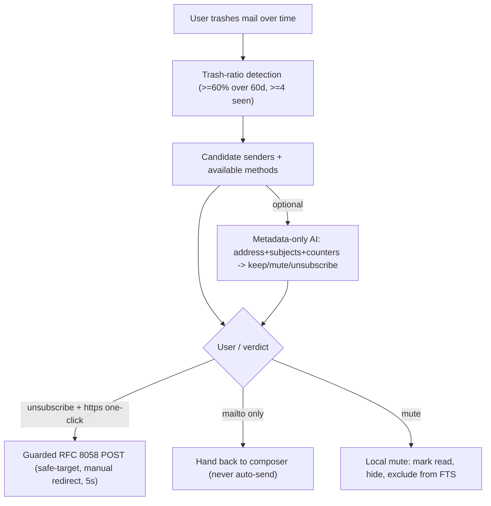

# GM-IP-03 — Behavioral unsubscribe pipeline: trash-ratio detection, metadata-only AI classification, and guarded RFC 8058 execution with local-mute alternative

> **Status: disclosure record, not a filed application. Not legal advice.** See
> [README.md](README.md). Keep confidential until counsel advises on filing.

## 1. Administrative

| Field           | Value                                  |
| --------------- | -------------------------------------- |
| Invention ID    | GM-IP-03                               |
| Inventor(s)     | _TBD — complete before filing_         |
| Conception date | _TBD_                                  |
| Disclosure date | _TBD_                                  |
| Status          | Implemented and shipping in GingerMail |

## 2. Technical field

Email clients; inbox hygiene; behavioral inference from local user actions;
privacy-preserving application of language models to metadata; safe automated
execution of one-click unsubscribe (RFC 8058) with anti-SSRF safeguards.

## 3. Problem addressed

Newsletters and promotional senders accrete. Unsubscribing is tedious, and the
tools that exist are unsatisfying for three reasons:

1. **Detection is naive.** Clients key off the presence of a `List-Unsubscribe`
   header, surfacing an unsubscribe button on transactional mail the user
   actually wants (receipts, security alerts), and missing noisy automated
   senders that lack the header but that the user routinely deletes.
2. **AI-assisted classification leaks content.** A natural way to ask "is this
   junk?" is to send message bodies to a model — exactly the privacy violation a
   local-first client must avoid.
3. **Automated unsubscribe is dangerous.** Blindly POSTing to a URL embedded in
   an email header is a server-side request forgery (SSRF) and tracking vector:
   the URL can point at internal addresses, redirect to attacker-controlled
   `http://` endpoints, or carry tracking tokens; and "silently" emailing a
   `mailto:` unsubscribe address on the user's behalf can unsubscribe them from
   things they wanted.

The problem is to detect _actual_ junk from the user's own behavior, optionally
refine with AI using **no message content**, and execute unsubscribe (or a local
alternative) **safely**.

## 4. Summary of the invention

A pipeline with three conservative stages plus a non-network alternative:

1. **Behavioral detection.** A sender becomes a candidate based on the user's own
   trash behavior — a configurable trash ratio (default ≥60%) over a lookback
   window (default 60 days), with a minimum number of observations (default 4) —
   excluding senders the user has already acted on. Detection is biased toward
   "almost certainly junk" to avoid banner fatigue.
2. **Metadata-only AI classification (optional).** Candidates may be refined by a
   language model that receives **only** the sender address, a few sample
   subject lines, and trashed-vs-total counters — never message bodies. The model
   returns `unsubscribe` / `mute` / `keep` with a confidence floor and a hard
   bias toward `keep` for anything resembling personal or transactional mail.
3. **Guarded RFC 8058 execution.** One-click unsubscribe is performed as an
   HTTPS-only POST with a strict safe-target allowlist (no `http`, no userinfo,
   no private/loopback/link-local IP ranges, length cap), a 5-second timeout, and
   manual redirect handling that refuses to follow to non-HTTPS or unsafe
   targets. `mailto:`-only senders are **not** auto-emailed; the composer is
   handed back to the user.
4. **Local mute alternative.** Instead of (or in addition to) unsubscribing,
   the user can locally mute a sender; subsequently fetched mail from that sender
   is marked read, hidden, and **excluded from the full-text index**, while
   remaining auditable. Unmuting + a fresh sync re-indexes it.

## 5. Detailed description

### 5.1 Behavioral detection from local trash actions

Candidacy is computed from the user's deletion behavior, with conservative,
tunable thresholds and exclusion of already-actioned senders:

```25:55:apps/main/src/unsubscribe/detect.ts
export function detectUnsubscribeSuggestions(
  db: GingerMailDb,
  opts: DetectOptions = {},
): UnsubscribeSuggestion[] {
  const windowDays = opts.windowDays ?? 60;
  const minTotal = opts.minTotal ?? 4;
  const ratio = opts.trashRatio ?? 0.6;
  const sinceMs = Date.now() - windowDays * 24 * 60 * 60 * 1000;
  const rows = db.countTrashedBySender({ sinceMs, minTotal });
  const out: UnsubscribeSuggestion[] = [];
  for (const r of rows) {
    if (r.total === 0) continue;
    const r_ratio = r.trashed / r.total;
    if (r_ratio < ratio) continue;
    out.push({
      email: r.email,
      trashedCount: r.trashed,
      totalSeen: r.total,
      exampleMessageId: r.exampleMessageId,
      methods: {
        http: r.listUnsubscribeHttp,
        mailto: r.listUnsubscribeMailto,
        oneClick: r.listUnsubscribePost,
      },
    });
  }
  return out;
}
```

The available unsubscribe methods are captured at sync time from the
`List-Unsubscribe`/`List-Unsubscribe-Post` headers (RFC 2369/8058) and stored
on each message, so detection can attach actionable methods to each candidate.

### 5.2 Metadata-only AI classification

The classifier is explicitly fed only address, sample subjects, and counters —
never bodies — and the contract documents that zero message text reaches the
model:

```666:704:packages/ai/src/client.ts
/**
 * Ask the AI to classify a batch of candidate senders. The caller (main
 * process) is expected to feed the heuristic candidates from the local DB
 * — we never send the full message body, only the address, subject, and
 * trashed-vs-seen counters, so the model has zero access to message text.
 * ...
 */
export async function classifySendersForUnsubscribe(
  client: AiClient,
  candidates: Array<{
    email: string;
    sampleSubjects: string[];
    trashed: number;
    total: number;
    hasListUnsubscribe: boolean;
  }>,
): Promise<UnsubscribeVerdict[]> {
  // ... sends only the metadata above; parses to unsubscribe|mute|keep ...
}
```

The prompt enforces the conservative posture and a confidence floor:

```52:62:packages/ai/src/prompts.ts
export function classifySendersForUnsubscribePrompt(): string {
  return [
    'You are evaluating email senders that the user routinely deletes without reading.',
    // ... unsubscribe / keep / mute definitions ...
    'Bias hard towards "keep" when there is any signal of personal correspondence or transactional value (receipts, account alerts).',
    'Reply ONLY with a JSON object of shape {"items":[{"email": string, "verdict": "unsubscribe"|"mute"|"keep", "confidence": 0..1, "reason": string}]}.',
    'Confidence must be at least 0.75 for any verdict other than "keep".',
  ].join(' ');
}
```

### 5.3 Guarded RFC 8058 execution

One-click unsubscribe is gated on an HTTPS-safe-target check, uses manual
redirect handling that refuses unsafe `Location` targets, and times out:

```36:91:apps/main/src/unsubscribe/perform.ts
export async function performUnsubscribe(input: {
  http?: string;
  mailto?: string;
  oneClick: boolean;
}): Promise<UnsubscribeResult> {
  if (input.http && input.oneClick && isSafeHttpsTarget(input.http)) {
    // ...
    const res = await fetch(input.http, {
      method: 'POST',
      headers: { 'content-type': 'application/x-www-form-urlencoded', 'user-agent': 'GingerMail-Unsubscribe/1.0' },
      body: 'List-Unsubscribe=One-Click',
      redirect: 'manual',
      signal: controller.signal,
    });
    if (res.status >= 300 && res.status < 400) {
      const loc = res.headers.get('location') ?? '';
      if (!isSafeHttpsTarget(loc)) {
        return { ok: false, method: 'http', error: `Server tried to redirect to an unsafe URL (${loc.slice(0, 80)})` };
      }
      // ... follow only to a safe HTTPS target ...
    }
    // ...
  }
  if (input.mailto) {
    // Return mailto info so the renderer can open the composer.
    return { ok: true, method: 'mailto' };
  }
  return { ok: false, method: 'none', error: 'No usable unsubscribe method.' };
}
```

The safe-target allowlist rejects non-HTTPS schemes, userinfo, over-long URLs,
and syntactic private/loopback/link-local IP ranges (anti-SSRF):

```102:133:apps/main/src/unsubscribe/perform.ts
export function isSafeHttpsTarget(raw: string): boolean {
  if (!raw || raw.length > 2048) return false;
  let url: URL;
  try { url = new URL(raw); } catch { return false; }
  if (url.protocol !== 'https:') return false;
  if (url.username || url.password) return false;
  const host = url.hostname.toLowerCase();
  if (!host) return false;
  if (host === 'localhost') return false;
  if (host === '::1' || host === '[::1]') return false;
  const v4 = host.match(/^(\d{1,3})\.(\d{1,3})\.(\d{1,3})\.(\d{1,3})$/);
  if (v4) {
    const a = Number(v4[1]); const b = Number(v4[2]);
    if (a === 10) return false;
    if (a === 127) return false;
    if (a === 169 && b === 254) return false; // link-local
    if (a === 172 && b >= 16 && b <= 31) return false;
    if (a === 192 && b === 168) return false;
    if (a === 0) return false;
  }
  // ... IPv6 fc00::/7, fe80:: filters ...
  return true;
}
```

### 5.4 Local mute with FTS de-indexing

Muting is the non-network alternative. On subsequent sync, a muted sender's mail
is marked read, flagged `muted=1`, and deliberately **omitted from the FTS
index** so it disappears from inbox and search while staying in the row store:

```469:477:packages/storage/src/db.ts
          isMuted ? 1 : 0,
        );
        ftsDelete.run(m.id);
        // Muted mail is intentionally left out of the FTS index so it
        // doesn't surface in search either. Unmuting + a fresh sync
        // re-inserts the row with muted=0 and re-indexes.
        if (!isMuted) {
          ftsInsert.run(m.id, m.subject, m.snippet, m.from.email, m.body?.text ?? '');
        }
```

Unmuting re-indexes the previously hidden rows ([packages/storage/src/db.ts](../../packages/storage/src/db.ts), un-hide + re-`ftsInsert` block around lines 498-528).

### 5.5 Pipeline



## 6. Novel / distinguishing features

- **Behavioral, content-free detection** keyed on the user's own trash actions
  rather than header presence — catches header-less junk and avoids
  transactional false positives.
- **Metadata-only AI classification** with a structural guarantee that no message
  body reaches the model, plus a conservative confidence floor and keep-bias.
- **Anti-SSRF guarded RFC 8058 execution**: HTTPS-only safe-target allowlist,
  private/loopback/link-local rejection, manual redirect validation, timeout, and
  refusal to auto-send `mailto:` unsubscribes.
- **Local mute with search de-indexing** as a reversible, no-network alternative
  that hides mail from both inbox and search while keeping it auditable.

## 7. Known / prior approaches and how this differs

| Prior approach                                    | How GM-IP-03 differs                                                                                                   |
| ------------------------------------------------- | ---------------------------------------------------------------------------------------------------------------------- |
| Header-presence unsubscribe buttons               | GM-IP-03 detects from behavior (trash ratio), reducing transactional false positives and catching header-less senders. |
| Cloud "unsubscribe" services scanning the mailbox | GM-IP-03 detects locally and, if AI is used, sends only metadata — never bodies.                                       |
| Naive auto-POST to List-Unsubscribe URLs          | GM-IP-03 applies an anti-SSRF safe-target allowlist, manual redirect validation, and a timeout.                        |
| Auto-sending mailto unsubscribes                  | GM-IP-03 refuses to auto-send; it hands the composer to the user.                                                      |
| Server-side filters/labels                        | GM-IP-03 offers a local mute that also de-indexes from search, reversible on unmute.                                   |

## 8. Claim sketches (plain language)

**Independent (method).** A computer-implemented method for inbox hygiene
comprising: deriving, from locally recorded user deletion actions, a trash ratio
per sender over a lookback window; designating a sender as an unsubscribe
candidate when its trash ratio and observation count exceed thresholds and it has
not been previously actioned; and executing, for a candidate having an
HTTPS one-click unsubscribe method, a one-click unsubscribe request only after
validating the target against a safety allowlist that rejects non-HTTPS schemes,
embedded credentials, and private, loopback, and link-local network addresses,
and validating any redirect target against the same allowlist.

**Dependent claims.**

- further comprising submitting, to a language model, only each candidate's
  address, sample subject lines, and trashed-versus-total counters — and not any
  message body — to obtain a keep/mute/unsubscribe verdict subject to a minimum
  confidence threshold for any non-keep verdict.
- wherein a candidate offering only a mailto unsubscribe method is not
  automatically emailed but is surfaced to a user composer.
- wherein the one-click request is aborted after a fixed timeout.
- further comprising a local mute action that, on subsequent synchronization,
  marks the sender's messages read, hides them, and excludes them from a
  full-text search index while retaining them in a row store.
- wherein removing the mute causes the previously excluded messages to be
  re-indexed.

## 9. Enablement pointers

- [apps/main/src/unsubscribe/detect.ts](../../apps/main/src/unsubscribe/detect.ts) — trash-ratio detection
- [apps/main/src/unsubscribe/perform.ts](../../apps/main/src/unsubscribe/perform.ts) — `performUnsubscribe`, `isSafeHttpsTarget`
- [packages/ai/src/client.ts](../../packages/ai/src/client.ts) — `classifySendersForUnsubscribe`
- [packages/ai/src/prompts.ts](../../packages/ai/src/prompts.ts) — `classifySendersForUnsubscribePrompt`
- [packages/storage/src/db.ts](../../packages/storage/src/db.ts) — `countTrashedBySender`, mute + FTS exclusion in `insertMessages`

## 10. Recommended protection strategy

- **Patent (method):** the behavioral-detection + metadata-only-AI +
  anti-SSRF-execution combination is patentable subject matter; the anti-SSRF
  safe-target validation and the metadata-only classification are the clearest
  novelty hooks.
- **Defensive publication:** the anti-SSRF allowlist and manual-redirect rules
  are also good candidates for defensive publication to preempt competitors from
  patenting similar guards, if a filing is not pursued.
- Prior-art search should cover "unsubscribe automation" and "email engagement
  scoring"; emphasize that detection is content-free and AI is metadata-only.
