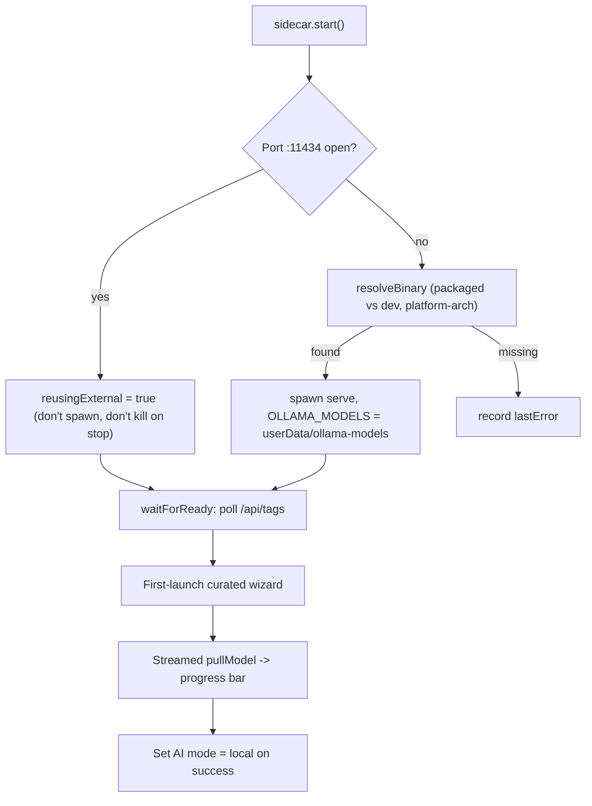

# GM-IP-04 — Bundled local-LLM sidecar with external-instance reuse, per-user model storage, streamed pull, and RAM-aware curated onboarding

> **Status: disclosure record, not a filed application. Not legal advice.** See
> [README.md](README.md). Keep confidential until counsel advises on filing.

## 1. Administrative

| Field           | Value                                  |
| --------------- | -------------------------------------- |
| Invention ID    | GM-IP-04                               |
| Inventor(s)     | _TBD — complete before filing_         |
| Conception date | _TBD_                                  |
| Disclosure date | _TBD_                                  |
| Status          | Implemented and shipping in GingerMail |

## 2. Technical field

Desktop applications that bundle and manage a local large-language-model (LLM)
runtime; process lifecycle management; first-run model onboarding UX for
privacy-preserving on-device AI.

## 3. Problem addressed

To offer AI features that never leave the device, a desktop app must ship and
operate a local inference runtime. Doing this naively causes several problems:

- **Duplicate runtimes.** Many target users already run a local LLM server
  (e.g. Ollama) on the standard port. Spawning a second bundled copy wastes
  memory and can collide on the port.
- **Install footprint sprawl.** Model weights are large and, if stored in a
  system default location, become unpredictable per-user and hard to clean up.
- **Opaque, scary downloads.** Pulling multi-gigabyte weights with no progress
  feedback feels broken; and presenting users with a giant menu of models is the
  number-one "pick a model" UX failure, especially for the cognitively-loaded
  audience this product targets.
- **Cross-platform packaging.** The runtime binary differs per OS/arch, and the
  dev and packaged layouts differ.

The problem is to bundle a local LLM runtime that **reuses** an existing instance
when present, otherwise **spawns** the bundled binary with **predictable
per-user** model storage, exposes **streamed** download progress, and is driven
by a **deliberately small, hardware-aware curated** onboarding list.

## 4. Summary of the invention

A managed **sidecar** for a local LLM runtime with the following coordinated
behaviors:

1. **Idempotent start with external-instance reuse.** The sidecar first probes
   the loopback port; if something is already listening, it marks itself
   "reusing external" and does not spawn a duplicate (and crucially does not kill
   that external instance on shutdown).
2. **Bundled binary resolution across dev/packaged + platform/arch.** It locates
   the correct binary under the packaged resources path or, in development, under
   a `<platform>-<arch>` directory.
3. **Per-user model storage.** It spawns the runtime with model storage pinned to
   the app's per-user data directory, keeping the install footprint predictable
   and removable.
4. **Readiness gating.** It polls the runtime's tags endpoint until ready (or a
   timeout), so the first inference call is gated on actual availability.
5. **Streamed model pull over IPC.** Model downloads are streamed line-by-line
   from the runtime to a renderer progress bar, tolerant of malformed chunks.
6. **RAM/disk-aware curated onboarding.** A deliberately short registry annotates
   each model with on-disk size and resident RAM, marking a `starter` (safe on
   8 GB) and a `recommended` default (typical 16 GB laptop), and drives a
   first-launch wizard that installs exactly one model with live progress.

## 5. Detailed description

### 5.1 Idempotent start + reuse, no-duplicate, no-kill

```43:85:apps/main/src/ai/ollamaSidecar.ts
  async start(opts: { timeoutMs?: number } = {}): Promise<void> {
    if (this.reusingExternal || (this.child && !this.child.killed)) return;
    if (await this.isPortOpen()) {
      this.reusingExternal = true;
      this.startedAt = Date.now();
      log.info('[ollama-sidecar] reusing existing instance on :11434');
      return;
    }
    const binary = this.resolveBinary();
    if (!binary) {
      this.lastError = 'Ollama binary not found in app resources. Run `pnpm fetch:ollama`.';
      log.warn(`[ollama-sidecar] ${this.lastError}`);
      return;
    }
    log.info(`[ollama-sidecar] spawning ${binary}`);
    this.child = spawn(binary, ['serve'], {
      stdio: ['ignore', 'pipe', 'pipe'],
      env: {
        ...process.env,
        OLLAMA_HOST: `${SIDECAR_HOST}:${SIDECAR_PORT}`,
        // Keep models under the user's app data dir rather than the system
        // default so the install footprint stays predictable per-user.
        OLLAMA_MODELS: path.join(app.getPath('userData'), 'ollama-models'),
      },
      detached: false,
      windowsHide: true,
    });
    // ... stdout/stderr piped to electron-log; exit handler clears child ...
    await this.waitForReady(opts.timeoutMs ?? 30_000);
  }
```

On shutdown, a reused external instance is deliberately **not** killed:

```87:96:apps/main/src/ai/ollamaSidecar.ts
  async stop(): Promise<void> {
    if (this.reusingExternal) {
      // We didn't start it; don't kill it.
      this.reusingExternal = false;
      return;
    }
    if (!this.child) return;
    // ... SIGTERM then SIGKILL fallback for our own child ...
```

### 5.2 Cross-platform binary resolution

```159:172:apps/main/src/ai/ollamaSidecar.ts
  private resolveBinary(): string | null {
    const exe = process.platform === 'win32' ? 'ollama.exe' : 'ollama';
    const candidates: string[] = [];
    if (app.isPackaged) {
      candidates.push(path.join(process.resourcesPath, 'ollama', exe));
    } else {
      const key = `${process.platform}-${process.arch}`;
      candidates.push(path.join(process.cwd(), 'apps', 'main', 'resources', 'ollama', key, exe));
    }
    for (const c of candidates) {
      if (existsSync(c)) return c;
    }
    return null;
  }
```

### 5.3 Readiness gating + port probe

`waitForReady` polls `/api/tags` until 200 or timeout, and `isPortOpen`
performs a short-timeout TCP connect to detect an external instance
([apps/main/src/ai/ollamaSidecar.ts](../../apps/main/src/ai/ollamaSidecar.ts), `waitForReady`, `isPortOpen`).

### 5.4 Streamed pull tolerant of malformed chunks

The pull reads the runtime's NDJSON stream, emitting progress per line and
swallowing malformed lines so a single bad chunk doesn't abort the download:

```338:379:packages/ai/src/client.ts
  async pullModel(
    name: string,
    onProgress: (evt: { status: string; completed?: number; total?: number }) => void,
  ): Promise<void> {
    const r = await fetch(`${this.baseUrl.replace(/\/$/, '')}/api/pull`, {
      method: 'POST',
      headers: { 'content-type': 'application/json' },
      body: JSON.stringify({ name, stream: true }),
    });
    if (!r.ok || !r.body) throw new Error(`Pull failed: ${r.status} ${r.statusText}`);
    const reader = r.body.getReader();
    // ... decode + split on newlines; JSON.parse each line; onProgress(...) ...
    // Swallow malformed lines so a single bad chunk doesn't abort the pull.
  }
```

### 5.5 RAM/disk-aware curated registry

The registry is intentionally short, Electron-free (so it loads under vitest),
and annotates each model with `sizeGB`, `ramGB`, and `starter`/`recommended`
flags tied to hardware tiers:

```12:47:apps/main/src/ai/curatedModels.ts
export interface CuratedModel {
  id: string; // Ollama tag, e.g. 'llama3.2:1b'
  displayName: string;
  sizeGB: number;
  ramGB: number;
  description: string;
  /** Marks a recommended default for typical 16GB laptops. */
  recommended?: boolean;
  /** Marks a model that fits comfortably on 8GB and is the safest first pick. */
  starter?: boolean;
}

export const CURATED_MODELS: CuratedModel[] = [
  {
    id: 'qwen2.5:0.5b',
    // ... 'Tiny. Good for basic search and unsubscribe classification on any laptop.'
    starter: true,
  },
  {
    id: 'llama3.2:1b',
    // ... 'Balanced default. Fast summaries and reply drafts on most hardware.'
    recommended: true,
  },
  // ... 3 more, up to qwen2.5:7b (needs 16GB+)
];
```

### 5.6 First-launch wizard with live progress

The onboarding wizard lists the curated models, streams pull progress into a
progress bar, marks already-installed models, and flips AI mode to `local` only
after a successful install:

```27:74:apps/renderer/src/onboarding/LocalAiWizard.tsx
/**
 * First-launch wizard for the bundled Ollama sidecar. The user picks a
 * model from the curated list and we stream the pull progress live. Skip
 * leaves AI mode unchanged (falls back to cloud-or-off).
 * ...
 */
export function LocalAiWizard({ opened, onClose, onModelInstalled }: LocalAiWizardProps) {
  // ... loads available + installed models, subscribes to onPullProgress,
  //     calls onModelInstalled(evt.name) on successful completion ...
}
```

### 5.7 Lifecycle



## 6. Novel / distinguishing features

- **Reuse-or-spawn with don't-kill-what-you-didn't-start** semantics for a
  bundled local LLM runtime — avoids duplicate processes and respects a
  user-managed instance.
- **Per-user model storage** pinned to the app data directory for a predictable,
  removable footprint.
- **Curated, hardware-tiered onboarding** (deliberately small list with
  size/RAM annotations and starter/recommended defaults) designed to minimize
  decision load — a UX-coupled technical mechanism.
- **Streamed, fault-tolerant model pull** surfaced over IPC to a live progress
  bar.

## 7. Known / prior approaches and how this differs

| Prior approach                                 | How GM-IP-04 differs                                                                                   |
| ---------------------------------------------- | ------------------------------------------------------------------------------------------------------ |
| App always spawns its own bundled runtime      | GM-IP-04 probes and reuses an existing loopback instance; never kills an instance it didn't start.     |
| Runtime stores models in a system default path | GM-IP-04 pins models to the per-user app data dir for predictable footprint.                           |
| "Download model" with no/opaque progress       | GM-IP-04 streams NDJSON progress, tolerant of malformed chunks, into a live bar.                       |
| Exposing the full model catalog                | GM-IP-04 curates a short list with size/RAM tiers and a single safe default to minimize decision load. |

## 8. Claim sketches (plain language)

**Independent (method).** A method for operating a local language-model runtime
bundled with a desktop application comprising: probing a loopback port for an
existing runtime instance; responsive to detecting an existing instance, using
that instance without spawning a duplicate and without terminating it when the
application exits; responsive to no existing instance, locating a bundled runtime
binary appropriate to the host platform and architecture and spawning it with a
model-storage location pinned to a per-user application data directory; polling a
readiness endpoint before issuing inference requests; and streaming model-
download progress events to a user interface.

**Dependent claims.**

- wherein a curated registry annotates each selectable model with an on-disk size
  and an expected resident memory, and designates a starter model and a
  recommended model by hardware tier.
- wherein the application presents a first-launch interface that installs a single
  selected model and only then enables an on-device AI mode.
- wherein streamed progress parsing tolerates malformed stream chunks without
  aborting the download.
- wherein the bundled binary is located under a packaged resources path when the
  application is packaged and under a platform-and-architecture-specific directory
  otherwise.

## 9. Enablement pointers

- [apps/main/src/ai/ollamaSidecar.ts](../../apps/main/src/ai/ollamaSidecar.ts) — `OllamaSidecar` (start/reuse/spawn/stop/resolveBinary/waitForReady/isPortOpen)
- [apps/main/src/ai/curatedModels.ts](../../apps/main/src/ai/curatedModels.ts) — `CuratedModel`, `CURATED_MODELS`
- [packages/ai/src/client.ts](../../packages/ai/src/client.ts) — `OllamaClient.pullModel`, `waitForReady`, `listInstalledModels`
- [apps/renderer/src/onboarding/LocalAiWizard.tsx](../../apps/renderer/src/onboarding/LocalAiWizard.tsx) — first-launch wizard
- [scripts/fetch-ollama.mjs](../../scripts/fetch-ollama.mjs) — bundling the platform binaries

## 10. Recommended protection strategy

- **Trade secret + defensive publication:** much of this is an engineering
  integration of an open-source runtime (Ollama), so broad method claims may face
  prior art. The reuse-or-spawn/don't-kill semantics and the per-user storage +
  hardware-tiered curation combination are the most distinctive; consider a
  defensive publication to preserve freedom-to-operate, and keep the specific
  curation tuning as a trade secret.
- If pursuing a patent, focus claims narrowly on the **reuse-without-terminate +
  per-user-pinned-storage + readiness-gated** lifecycle as a unit, and run a
  prior-art search against existing local-AI desktop launchers first.
