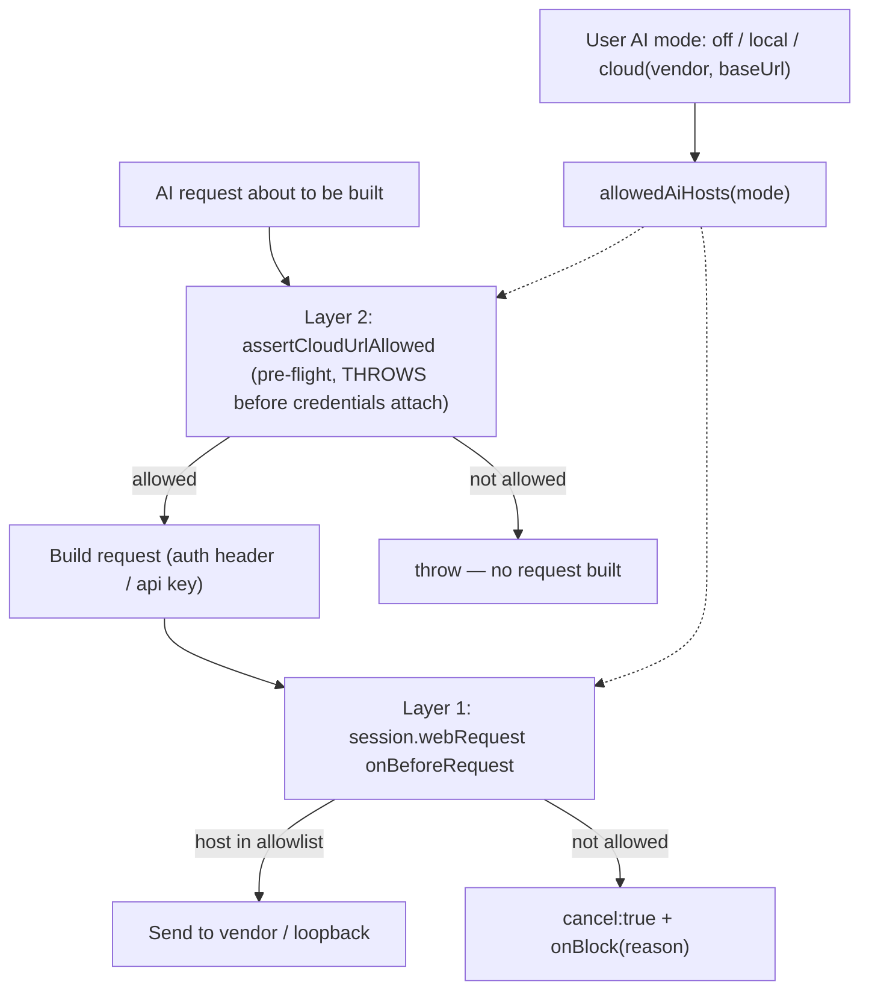

# GM-IP-05 — Mode-aware dual-layer AI egress control for a desktop application

> **Status: disclosure record, not a filed application. Not legal advice.** See
> [README.md](README.md). Keep confidential until counsel advises on filing.

## 1. Administrative

| Field           | Value                                  |
| --------------- | -------------------------------------- |
| Invention ID    | GM-IP-05                               |
| Inventor(s)     | _TBD — complete before filing_         |
| Conception date | _TBD_                                  |
| Disclosure date | _TBD_                                  |
| Status          | Implemented and shipping in GingerMail |

## 2. Technical field

Application security; outbound-network egress control; privacy controls for
desktop applications that send user content to AI services; defense-in-depth
allowlisting tied to a user-selected privacy mode.

## 3. Problem addressed

When a desktop email client integrates AI, the AI tier becomes a uniquely
dangerous egress path: it is the one place where the user's most sensitive data
(message bodies) is deliberately sent off-device. A user who chooses "local
only" (on-device model) or "off" expects that nothing related to AI leaves the
machine; a user who chooses a specific cloud vendor expects traffic to go to
**that** vendor and nowhere else.

Two failure modes must be prevented:

1. **Misconfiguration / typo leakage.** A wrong or attacker-influenced `baseUrl`
   could send credentials and content to an unexpected host; redirect-chasing
   could leak to a third party.
2. **Bypass of the call-site check.** Any future code path that issues an AI
   request without going through the vetted client would escape a single
   client-side guard.

A single check at the call site is insufficient (it can be bypassed), and a
single network-layer block is insufficient (by the time it fires, credentials
and content are already in the request and cannot be redacted). The problem is to
enforce, **based on the user's chosen AI mode**, a tight egress allowlist with
**two independent layers** placed at different points in the request lifecycle.

## 4. Summary of the invention

A two-layer egress control whose allowlist is **computed from the user's current
AI mode**:

1. **Pre-flight call-site check.** Before an AI request is built, the client
   validates the destination URL against the mode-appropriate allowlist:
   HTTPS-only for cloud, restricted to the configured vendor host (plus an
   explicitly-configured self-hosted host), and it **throws** rather than
   returning so a failure cannot be silently swallowed. This stops the leak
   _before_ credentials are attached.
2. **Independent network-layer filter.** An Electron `session.webRequest`
   `onBeforeRequest` filter on the AI session cancels any outbound request whose
   host is not on the same mode-derived allowlist. This is defense-in-depth: it
   catches any path that bypasses the client, even though (as the code notes) it
   cannot redact a URL or body because the request already exists by then.

The allowlist itself is a pure function of mode: `off` → allow nothing;
`local` → loopback (`127.0.0.1`/`localhost`) only, and plain `http` permitted
**only** on loopback; `cloud` → the per-vendor host(s) plus the user's
explicitly configured `baseUrl` host, HTTPS required, with **no inheritance** of
the vendor's wider CDN tree.

## 5. Detailed description

### 5.1 Mode-derived allowlist (pure, testable)

```36:56:apps/main/src/security/aiEgress.ts
export function allowedAiHosts(settings: AiSettings): string[] {
  if (settings.mode === 'off') return [];
  if (settings.mode === 'local') {
    // Bundled or external Ollama sidecar listens on the loopback only.
    return ['127.0.0.1', 'localhost'];
  }
  if (settings.mode === 'cloud' && settings.cloud) {
    const vendorHosts = AI_VENDOR_HOSTS[settings.cloud.vendor] ?? [];
    // Also allow the user's explicit baseUrl host, in case they pointed at
    // a self-hosted OpenAI-compatible proxy. We do NOT inherit anything
    // from the vendor's CDN tree — only the exact host they configured.
    try {
      const u = new URL(settings.cloud.baseUrl);
      if (u.hostname) return Array.from(new Set([...vendorHosts, u.hostname]));
    } catch {
      /* baseUrl malformed; fall through to vendor list only */
    }
    return vendorHosts;
  }
  return [];
}
```

### 5.2 Per-URL decision with protocol rules

```62:89:apps/main/src/security/aiEgress.ts
export function isUrlAllowedForAi(url: string, settings: AiSettings): EgressDecision {
  let parsed: URL;
  try { parsed = new URL(url); } catch { return { allowed: false, reason: 'malformed-url' }; }
  if (parsed.protocol !== 'https:' && parsed.protocol !== 'http:') {
    return { allowed: false, reason: `disallowed-protocol:${parsed.protocol}` };
  }
  if (settings.mode === 'local' && parsed.protocol === 'http:') {
    // Localhost is the only place plain http is acceptable (Ollama).
    if (parsed.hostname !== '127.0.0.1' && parsed.hostname !== 'localhost') {
      return { allowed: false, reason: 'http-disallowed-off-loopback' };
    }
  }
  if (settings.mode === 'cloud' && parsed.protocol !== 'https:') {
    return { allowed: false, reason: 'cloud-must-be-https' };
  }
  const hosts = allowedAiHosts(settings);
  if (hosts.length === 0) return { allowed: false, reason: 'ai-mode-off' };
  const ok = hosts.some((h) => parsed.hostname === h || parsed.hostname.endsWith(`.${h}`));
  return ok ? { allowed: true } : { allowed: false, reason: `host-not-allowlisted:${parsed.hostname}` };
}
```

### 5.3 Layer 1 — network-layer filter (defense-in-depth)

```98:113:apps/main/src/security/aiEgress.ts
export function installAiEgressFilter(
  session: Session,
  getSettings: () => AiSettings,
  onBlock?: (info: { url: string; reason: string }) => void,
): void {
  session.webRequest.onBeforeRequest({ urls: ['<all_urls>'] }, (details, callback) => {
    const settings = getSettings();
    const decision = isUrlAllowedForAi(details.url, settings);
    if (decision.allowed) {
      callback({ cancel: false });
      return;
    }
    onBlock?.({ url: details.url, reason: decision.reason ?? 'unknown' });
    callback({ cancel: true });
  });
}
```

The module header states the rationale for having both layers, including why the
network filter alone is insufficient (it cannot redact an already-built request):

```1:22:apps/main/src/security/aiEgress.ts
/**
 * Main-process AI egress filter.
 * ... two complementary protections ...
 * Why both: the webRequest filter is defense-in-depth (catches any future
 * sneaky path that bypasses our client), but it ALSO can't redact the
 * URL or body — by the time it fires, the credentials are already inside
 * the request. The call-site check stops the leak earlier.
 */
```

### 5.4 Layer 2 — pre-flight call-site check that throws

The cloud client validates before building each request and **throws** (so a
caller cannot fall through to a worse default), requiring HTTPS and host
membership, and never logging the URL (which may carry tokens):

```20:55:packages/ai/src/client.ts
/**
 * Guard against egress to anything other than the configured vendor host.
 * Throws (instead of returning) so callers don't accidentally swallow the
 * failure and silently fall through to a worse default.
 */
function assertCloudUrlAllowed(
  url: string,
  vendor: 'openai' | 'anthropic' | 'google',
  baseUrl: string,
): void {
  let parsed: URL;
  try { parsed = new URL(url); } catch { throw new Error(`[ai] refusing to call malformed URL`); }
  if (parsed.protocol !== 'https:') {
    throw new Error(`[ai] refusing non-HTTPS cloud call to ${parsed.hostname}`);
  }
  const allowed = new Set<string>(AI_VENDOR_HOSTS[vendor]);
  try {
    const base = new URL(baseUrl);
    if (base.hostname) allowed.add(base.hostname);
  } catch { /* malformed baseUrl: vendor list only */ }
  const ok = Array.from(allowed).some(
    (h) => parsed.hostname === h || parsed.hostname.endsWith(`.${h}`),
  );
  if (!ok) {
    // Log the host explicitly but never the URL (URL may carry tokens).
    throw new Error(
      `[ai] refusing call to non-allowlisted host '${parsed.hostname}' (vendor=${vendor})`,
    );
  }
}
```

`assertCloudUrlAllowed` is invoked at the top of every cloud request method
(`chatOpenAi`, `chatAnthropic`, `chatGemini`) before the `fetch`
([packages/ai/src/client.ts](../../packages/ai/src/client.ts)). This layer pairs
with opt-in PII redaction applied to message bodies before send (`applyPrivacy`).

### 5.5 Two layers, two lifecycle points



## 6. Novel / distinguishing features

- **Allowlist derived from a user-selected privacy mode**, including the rule
  that plain `http` is permitted _only_ on loopback (for the local model) and
  `off` blocks everything.
- **Two independent enforcement layers at different lifecycle points**: a
  throwing pre-flight check (stops the leak before credentials/content are
  attached) and a network-layer cancel (catches any bypass).
- **No CDN-tree inheritance**: only the exact configured vendor/self-hosted host
  is allowed, not its broader domain footprint.
- **Token-safe failure logging**: the host is logged but never the URL, since the
  URL may carry secrets.

## 7. Known / prior approaches and how this differs

| Prior approach                                   | How GM-IP-05 differs                                                                                                                         |
| ------------------------------------------------ | -------------------------------------------------------------------------------------------------------------------------------------------- |
| Content Security Policy / connect-src allowlists | CSP governs renderer fetches generically; GM-IP-05 derives the AI-specific allowlist from privacy mode and adds a throwing pre-flight check. |
| Single client-side allowlist                     | A lone call-site guard can be bypassed; GM-IP-05 adds an independent network-layer filter.                                                   |
| Single network-layer firewall rule               | Fires too late to redact; GM-IP-05 pairs it with a pre-flight throw before the request is built.                                             |
| Static per-app egress rules                      | GM-IP-05's allowlist is a function of the user's runtime AI mode (off/local/cloud) and configuration.                                        |

## 8. Claim sketches (plain language)

**Independent (method).** A method for controlling outbound network egress of an
artificial-intelligence tier in a desktop application comprising: maintaining a
user-selectable AI mode having at least an off mode, an on-device mode, and a
cloud mode; computing an allowed-host set as a function of the mode, wherein the
off mode allows no host, the on-device mode allows only loopback hosts and
permits unencrypted transport only on loopback, and the cloud mode allows only a
configured vendor host and an explicitly configured host; performing, prior to
constructing an AI request and before attaching credentials, a pre-flight check
that aborts the request when its destination is not in the allowed-host set; and
independently, at a network-request interception layer, cancelling any outbound
request whose destination is not in the allowed-host set.

**Dependent claims.**

- wherein the pre-flight check raises an exception rather than returning a value,
  so callers cannot silently proceed on failure.
- wherein the cloud mode allowed-host set does not include subdomains of the
  vendor beyond the configured host.
- wherein a failure of the pre-flight check is logged with the destination host
  but not the destination URL.
- wherein, prior to sending in the cloud mode, message content is optionally
  redacted of personally identifiable information.
- wherein host membership is satisfied by an exact host match or a subdomain of
  an allowed host.

## 9. Enablement pointers

- [apps/main/src/security/aiEgress.ts](../../apps/main/src/security/aiEgress.ts) — `allowedAiHosts`, `isUrlAllowedForAi`, `installAiEgressFilter`
- [packages/ai/src/client.ts](../../packages/ai/src/client.ts) — `assertCloudUrlAllowed`, per-method invocation, `applyPrivacy`
- [packages/core/src/models.ts](../../packages/core/src/models.ts) — `AiMode`, `AiSettings`, `AI_VENDOR_HOSTS`
- [apps/main/src/main.ts](../../apps/main/src/main.ts) — `installAiEgressFilter` wiring at startup

## 10. Recommended protection strategy

- **Defensive publication (primary):** allowlisting and egress filtering are
  well-trodden; the strongest move may be a defensive publication of the
  **mode-derived, two-layer, lifecycle-staged** design to preserve
  freedom-to-operate.
- **Patent (secondary):** if a prior-art search shows the specific combination
  (mode-function allowlist + throwing pre-flight that stops leakage before
  credential attachment + independent network-layer cancel) is novel, pursue a
  narrow method claim emphasizing the _lifecycle placement_ of the two layers as
  the inventive step.
- Coordinate with GM-IP-04 (local sidecar) and the broader hardening story in
  [docs/security-hardening.md](../security-hardening.md) when briefing counsel.
